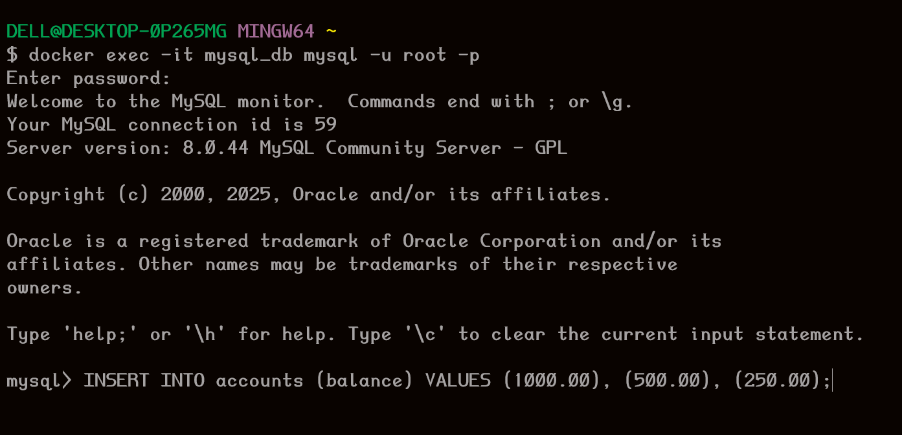

# Complete Dockerized Application

This is a basic 3-tier Banking Application with an HTML frontend, Express backend, and MySQL as the database. The main goal is to demonstrate Docker Compose and explore various optimization strategies.

---

## Running the Application

### Step 1: Clone the GitHub Repository

First, clone the repository to your local machine:

```bash
git clone https://github.com/YashChavanWeb/Complete-Dockerized-Application.git
```

### Step 2: Start Docker Desktop

Ensure Docker Desktop is running on your machine. Then, navigate to the project root directory and build the application using Docker Compose:

```bash
docker-compose up --build
```

To stop the application:

```bash
docker-compose down
```

---

## Initializing the Database

Upon startup, the application requires some initial records in the MySQL database for withdrawal and deposit transactions (for the `accounts` table).

1. Enter the MySQL shell within the running container:

```bash
docker exec -it mysql_db mysql -u root -p
```

## Reference



---

2. Enter the password when prompted (the password is `rootpassword`).

3. Once inside the MySQL shell, the necessary tables will be automatically created. However, you can insert some initial records with the following SQL query:

```sql
INSERT INTO accounts (balance) VALUES (1000.00), (500.00), (250.00);
```

This will create three initial account balances for users to interact with.

---

## Accessing the Application

- **Frontend (HTML)**: [localhost:8080](http://localhost:8080)
- **Backend (API)**: [localhost:5000](http://localhost:5000)

### Viewing Logs

To view the logs of the backend service, you can use the following command:

```bash
docker logs backend_api
```

---
